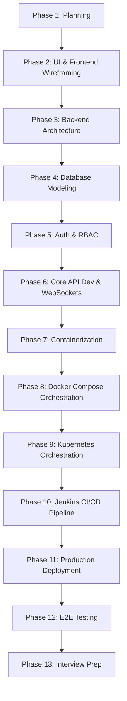

# OpsPulse: Incident Command Center 🚨

Welcome to **OpsPulse**, a production-like incident management and service reliability platform. This project is engineered to simulate real-world service uptime monitoring, alert routing, on-call paging, and MTTR/MTTA reliability metric tracking. It serves as a comprehensive portfolio piece demonstrating modern Full-Stack MERN development integrated with advanced DevOps workflows (Docker, Kubernetes, Jenkins CI/CD, and Nginx Ingress).

---

## 🗺️ Master Project Roadmap



---

## 🛠️ System Architecture

```text
       +---------------------------------------------+
       |             Client (React SPA)              |
       +----------------------+----------------------+
                              |
                     WebSocket / HTTP
                              |
                              v
       +----------------------+----------------------+
       |             Nginx Ingress / Proxy           |
       +----------------------+----------------------+
                              |
               +--------------+--------------+
               | /api/*                      | (static files)
               v                             v
       +-------+-------+             +-------+-------+
       |  Express API  |             |  React Build  |
       |  (Stateless)  |             |  Static Serv  |
       +---+-------+---+             +---------------+
           |       |
           |       +-------------------------+
           |                                 |
           v                                 v
   +-------+-------+                 +-------+-------+
   |    MongoDB    |                 | Redis Adapter |
   | (Data Store)  |                 | (PubSub/Sync) |
   +---------------+                 +-------+-------+
                                             ^
                                             |
                                    Publish Alerts
                                             |
                                     +-------+-------+
                                     |  Cron Worker  |
                                     | (Uptime Check)|
                                     +-------+-------+
                                             |
                                      Pings (HTTP/TCP)
                                             |
                                             v
                                     +-------+-------+
                                     | Ext. Services |
                                     +---------------+
```

---

# 🚀 Phase 1: Project Planning & Repository Setup

This phase is dedicated to setting up the workspace foundations, understanding the system requirements, modeling the data flow, and establishing a professional directory structure and Git lifecycle.

## 🎯 Phase 1 Objective
* Establish the developer workspace.
* Configure Git and repository standards (directories, ignore files).
* Understand incident-management vocabulary (MTTA, MTTR, SLAs, On-Call, Uptime).
* Create the technical specs for the database and APIs.

## 🧠 Concepts to Learn
1. **Mean Time to Acknowledge (MTTA)**: Average time it takes from an incident being triggered to a responder acknowledging it.
2. **Mean Time to Resolve (MTTR)**: Average time from the initial trigger of an incident to its resolution.
3. **SLA (Service Level Agreement)**: Commitments between service providers and customers regarding performance and uptime.
4. **On-Call Rotation**: Scheduling developers to handle production issues out-of-hours or during specific shifts.
5. **Git Workflows**: Writing semantic, atomic commits to ensure clear project evolution history.

## 📂 Target Project Directory Structure
We will create this directory skeleton in this phase:
```text
opspulse/
├── backend/
├── frontend/
├── k8s/
├── jenkins/
├── docker-compose.yml
├── .gitignore
└── README.md
```

## 💻 Commands
1. **Initialize Git**:
   ```bash
   git init
   ```
2. **Create Directories**:
   ```bash
   mkdir backend frontend k8s jenkins
   ```

## 📝 Configuration Files

### `.gitignore`
We must ensure we do not commit local environment secrets, compiled build outputs, or node_modules to Git:
```text
# Dependency directories
node_modules/

# Local env files
.env
.env.local
.env.development.local
.env.test.local
.env.production.local

# Build output
dist/
build/
out/

# Log files
npm-debug.log*
yarn-debug.log*
yarn-error.log*
logs/
*.log

# IDE and OS files
.vscode/
.idea/
.DS_Store
Thumbs.db
```

---

## ⚠️ Common Mistakes to Avoid
* **Committing Secrets**: Never commit `.env` files to git. Use `.env.example` as a template for team members.
* **Large Monolithic Commits**: Committing a whole phase in one single `git commit -m "finished phase 1"` makes reverting changes and auditing difficult. Use atomic commits (e.g. `feat(git): add gitignore and directory structure`).
* **Messy Folder Organization**: Mixing infrastructure code (Kubernetes/Docker) with application code makes pipelines complex. Keep them in dedicated root-level folders (`/k8s`, `/jenkins`).

## 🏆 Best Practices
* **Keep Code DRY (Don't Repeat Yourself)**: Design reusable utilities for formatting datetimes and computing statistics.
* **Semantic Commits**: Use conventional commits syntax (`feat:`, `fix:`, `docs:`, `chore:`, `refactor:`).
* **Environment Separation**: Ensure database connection strings, JWT secrets, and target URLs are read strictly from environment variables.

---

## ❓ Interview Preparation Questions
1. **What is the difference between MTTA and MTTR, and why are they critical performance indicators for SREs/DevOps?**
   * *Answer*: MTTA measures the time between alert firing and human recognition. High MTTA indicates a broken alert routing or pager system. MTTR measures the time between firing and resolution. High MTTR suggests poor diagnostic tools, complex code bases, or slow deployment pipelines.
2. **How does Nginx act as a Reverse Proxy vs. a Load Balancer?**
   * *Answer*: A reverse proxy sits in front of a web server and forwards client requests to it, shielding the backend server. A load balancer distributes incoming client requests across multiple backend servers to prevent overload and ensure high availability. Nginx can perform both roles simultaneously.

---

## 🤝 Git Commit Milestones for this Phase
* `chore(git): initialize git repository and create .gitignore`
* `chore(struct): create directory structure for backend, frontend, k8s, and jenkins`

---

## ✅ Final Checklist
- [x] Git initialized.
- [x] `.gitignore` created with appropriate rule sets.
- [x] Root directories `backend`, `frontend`, `k8s`, `jenkins` created.
- [x] Architectural overview documented.
- [x] Database schema planned.
- [x] First commits recorded.
